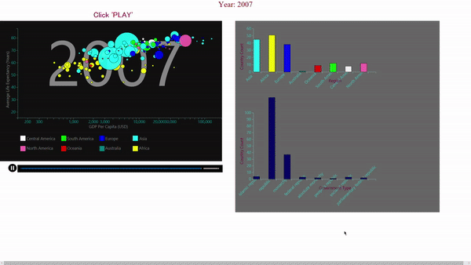

# data-visualization

This data visualization is a tribute Hans Rosling, a famous statistician, and public speaker who had the ability to bring life to the data. Inspired by one of his "story-telling-with-the-data" project, I have tried to get into his mind-set.  
It has  Scatter plot with colour groupings and size encoding for the third variable of country size

This is how it looks once the setup is ready!  

  

A lot of things have happened in the last century. A couple of world wars accompanied by
the cold war, landing on the moon, the invention of the Internet, the increase in the human
life expectancy, the formation of new nations and the changes in the types of government
are the key highlights of the 20th century.
The way the world operates and the way people live today is quite different than the way it
used to be 100 years ago.
I am illustrating a story here of how things looked way back in the 1900s and how things are
today. When you see the changes took place in the entire story gives you a platform to
launch multiple scenarios of what could have had happened.
I will help to visualize a dataset of 10 columns which has 80k rows. This dataset has the data
of the last 100 years for each country that mainly includes its population, its GDP and
average life expectancy.
The increase in the population of the world had its impact on the entire world in the last 100
years.

